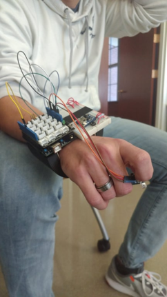
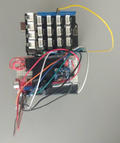
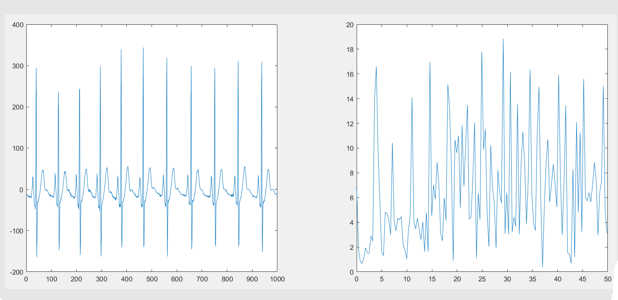
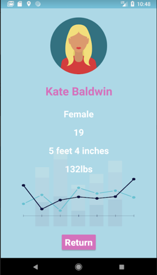
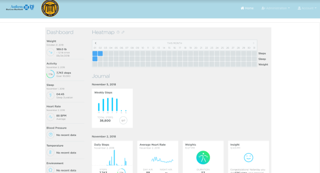

# Anxpression - Panic Attack Detector

This project was created for 2018 Health Hackathon. The project, therefore, is not complete and is just a proof of concept.

## Main Objective:
Issue
---
Young Children w/ Anxiety & Veterans w/ PTSDs cannot effectively convey their emotions:
- Hard to tell when they’re uncomfortable or anxious until they’re already upset
- Difficult for them to express their emotions/feelings beforehand
Current vitals monitors are for general health tracking, not specific needs:
- Knowing HR is interesting, but does little to help the anxious person
- HR is not enough to know on its own if a child or vet is on the verge of having an anxiety attack
Solution
---
Anxpression Monitor Band:
- Measures HR, RR, Change in Humidity, Skin Temp
- Informs parents/caretakers of impending anxiety episode before the onset of an actual attack
Mobile Application:
- Allows parent/significant other to input basic demographic info
- Easy push notification sent when the band detects certain vital thresholds that are associated with anxiety episodes
- Easy to set-up and use; no training required
- Google Cloud data storage for secure storage via Firebase
- Arduino watch can receive data from the Firebase
## Benefits
- Fourier Transform allows for accurate & scientific calculation of RR for the patient without explicit need for a chest device
- Reduces cost and fears for small children who may not understand such a complicated device
- Reduces fears for PTSD veterans as well
- Skin Temp probe allows device to discern between physical exercise and potential anxiety attack
- Easy to use and notifications sent not just to user, but also parent/loved ones
- MACHINE LEARNING
- PhysioNet Data and MatLab Fourier Transform
- High accuracy with AI 
- HIPAA compliant through Single Sign-On usage (fingerprint or unique username+password hashes) 
## Future Plans
- Ambient Sound tracking to factor in risk 
- Provide recommended breathing exercises for the user
- Client-Side UI specifically for primary providers
- Tremor detection specifically (must differ from physical movement) 
## Project Detail

---

### Hardware
Biometric wearable was developed in order to provide cheap and effective biometric monitoring to the patient. Audriono based hardware is responsible for sending biometric data to the google cloud platform to be used for predictive modeling.

### 

### Software
Wide array of technology stack was utilized to provide both patients and healthcare providers with best user experience.

GCP service utilizing Google ML Engine was responsible for continuously updating the predictive model. Model created then used to preditc panic attack was then utilized by many cloud services such as Firebase and AWS to send important information to our Mobile and Web clients.

Android Mobile application:

Web client:

